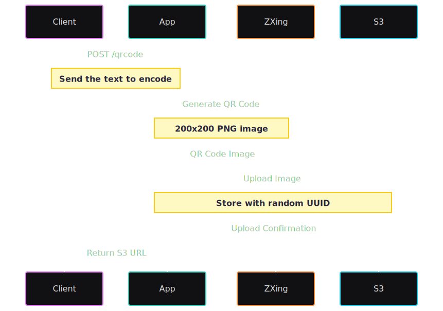

# 🎯 QR Code Generator


---

## 📄 Descrizione / Descrição

🇮🇹 Applicazione backend scritta in Java con Spring Boot che genera codici QR da un testo o link. L'immagine PNG generata viene salvata in Amazon S3, e l'URL viene restituito come risposta. Il progetto è progettato per essere semplice, estensibile e adatto a casi d'uso reali.

🇧🇷 Aplicação backend escrita em Java com Spring Boot que gera QR Codes a partir de um texto ou link. A imagem PNG gerada é armazenada na Amazon S3 e a URL é retornada como resposta. O projeto foi pensado para ser simples, extensível e aplicável a casos de uso reais.

---

## 📚 Sommario / Sumário

- [🛠 Tecnologie e motivazioni / Tecnologias e motivos](#-tecnologie-e-motivazioni--tecnologias-e-motivos)
- [🚀 Come eseguire / Como executar](#-come-eseguire--como-executar)
- [☁️ Configurazione S3 / Configuração do S3](#️-configurazione-s3--configuração-do-s3)
- [📊 Funzionamento / Funcionamento](#-funzionamento--funcionamento)
- [📮 Endpoints API](#-endpoints-api)
- [🧠 Miglioramenti futuri / Melhorias futuras](#-miglioramenti-futuri--melhorias-futuras)
- [📄 Licenza / Licença](#-licenza--licença)
- [🙋‍♂️ Autore / Autor](#-autore--autor)

---

## 🛠 Tecnologie e motivazioni / Tecnologias e motivos

- **Java 21** → linguaggio moderno e robusto / linguagem moderna e robusta
- **Spring Boot 3.5.0** → framework affidabile per API REST / framework confiável para APIs REST
- **ZXing** → libreria leggera per generare codici QR / biblioteca leve para gerar QR Codes
- **AWS S3 (SDK v2)** → storage scalabile e sicuro / armazenamento escalável e seguro
- **Docker** → facilita il deploy e l'esecuzione locale / facilita o deploy e execução local
- **Maven** → strumento standard per build in Java / ferramenta padrão de build no Java
- **JUnit + Mockito** → test unitari e affidabilità / testes unitários e confiabilidade

---

## 🚀 Come eseguire / Como executar

### 🔧 In locale / Localmente

```bash
git clone https://github.com/alepspizzetti/qrcodegen.git
cd qrcodegen
```

Crea un file `.env` / Crie um arquivo `.env`:

```env
AWS_ACCESS_KEY_ID=...
AWS_SECRET_ACCESS_KEY=...
AWS_REGION=...
AWS_BUCKET_NAME=...
```

Esegui / Rode:

```bash
./mvnw clean install
./mvnw spring-boot:run
```

Applicazione disponibile su / Aplicação disponível em: [http://localhost:8080](http://localhost:8080)

---

### 🐳 Docker

```bash
docker build -t qrcodegen .
docker run --env-file .env -p 8080:8080 qrcodegen
```

---

## ☁️ Configurazione S3 / Configuração do S3

1. Crea un bucket S3 nella tua console AWS
2. Configura i permessi per `putObject`
3. (Opzionale) Aggiungi una regola di ciclo di vita per eliminare i file dopo X giorni
4. Usa prefissi come `temp/` per differenziare file temporanei

---

## 📊 Funzionamento / Funcionamento



1. Il client invia un POST con il testo o link
2. L'API genera il QR Code (formato PNG)
3. L'immagine viene caricata su S3
4. L'URL viene restituito al client

---

## 📮 Endpoints API

### `POST /qrcode`

#### Richiesta / Requisição:

```json
{
  "link": "https://test.com",
  "widthQrCode": 300,
  "heightQrCode": 300
}
```

#### Risposta / Resposta:

```json
{
  "url": "https://seu-bucket.s3.amazonaws.com/temp/uuid.png"
}
```

#### Errori possibili / Possíveis erros:

- `400 Bad Request` → dati non validi / dados inválidos
- `500 Internal Server Error` → errore nella generazione o upload / erro ao gerar ou fazer upload do QR

---

## 🧠 Miglioramenti futuri / Melhorias futuras

- Integrazione con Telegram o email
- Documentazione Swagger/OpenAPI
- Autenticazione con token
- Salvataggio dei metadati e data di scadenza
- Deploy continuo con GitHub Actions e Render

---

## 📄 Licenza / Licença

Licenza MIT — vedi / veja o arquivo [LICENSE](LICENSE)

---

## 🙋‍♂️ Autore / Autor

Sviluppato da / Desenvolvido por **Alessandro Pizzetti**  
📧 a.pspizzetti@gmail.com  
🌍 [LinkedIn](https://www.linkedin.com/in/alepspizzetti/) • [GitHub](https://github.com/alepspizzetti)
